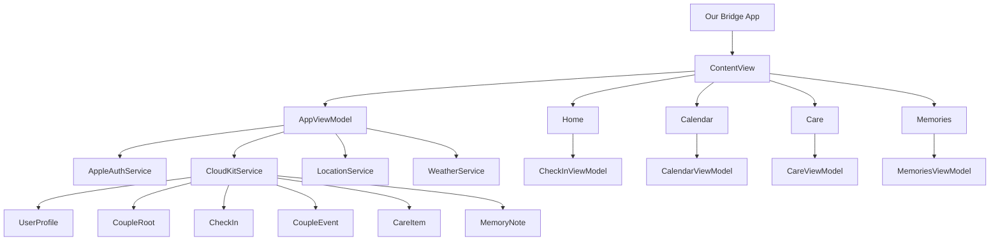

# Our Bridge

### 장거리 커플을 위한 조용한 일상 공유 앱

Our Bridge는 떨어져 있는 두 사람이 서로의 하루, 기분, 일정, 사진을 부담 없이 확인할 수 있도록 만든 iOS 앱입니다.
메신저를 대체하기보다 서로의 생활 리듬과 마음을 자연스럽게 느끼는 것에 집중합니다.

<a href="https://apps.apple.com/kr/app/our-birdge-%EA%B1%B0%EB%A6%AC%EC%9D%98-%EC%9E%A5%EB%B2%BD%EC%9D%84-%EB%84%98%EC%96%B4-%EB%8B%A4%EC%8B%9C-%EC%9A%B0%EB%A6%AC%EB%A1%9C/id6787828706">
 
</div>


## 목차
- [🚀 개발 기간](#-개발-기간)
- [💻 개발 환경](#-개발-환경)
- [👀 미리 보기](#-미리-보기)
- [⚙️ 주요 기능](#-주요-기능)
- [📐 아키텍처 요약](#-아키텍처-요약)
- [📝 개발 내용](#-개발-내용)
- [📁 파일 구조](#-파일-구조)

---

# 🚀 개발 기간

2026.06 ~ 진행 중

# 💻 개발 환경

- `Xcode 26.4`
- `Swift 5`
- `SwiftUI`
- `iOS 18.0+`
- `CloudKit`
- `Sign in with Apple`
- `OpenWeather API`

# 👀 미리 보기

<div>
  
  
  
</div>

# ⚙️ 주요 기능

- Apple 로그인
- 초대 코드 기반 커플 연결
- 기분 공유 및 현재 상태 공유
- 내 시간/상대방 시간, 위치 기반 날씨 표시
- 이전 만남과 다음 만남 D-day 표시
- 공유 캘린더
- 서로 챙김 목록
- 오늘의 한 장 사진 공유
- 연결된 다리 진행도
- 프로필 이름/사진 설정
- 커플 연결 끊기 및 회원 탈퇴

# 📐 아키텍처 요약



# 📝 개발 내용

### 앱의 방향성

- 장거리 커플이 상대방에게 계속 메시지를 보내지 않아도 하루의 흐름을 느낄 수 있는 앱을 목표로 했습니다.
- 홈 화면은 다음 만남, 서로의 시간과 날씨, 기분 공유, 연결된 다리 진행도를 중심으로 구성했습니다.
- 앱의 톤은 따뜻하고 조용한 개인 공간에 가깝게 잡았습니다.

### 데이터 동기화

- Firebase 기반 구조에서 Apple 로그인과 CloudKit 기반 구조로 전환했습니다.
- 커플 데이터는 CloudKit 공유 영역을 사용해 두 사용자 간에 동기화합니다.
- CloudKit 응답 지연을 줄이기 위해 로컬 캐시를 함께 사용합니다.

### 주요 화면

- `홈`: 다음 만남, 기분 공유, 시간/날씨, 연결된 다리 카드
- `캘린더`: 월간 캘린더, 일정 등록/수정/삭제
- `챙김`: 서로 챙김 목록, 반복 설정, 완료 처리, 지난 챙김 보기
- `한 장`: 오늘의 사진 공유, 썸네일 목록, 상세 원본 로딩
- `설정`: 프로필, 커플 연결 관리, 법적 문서, 회원 탈퇴

# 📁 파일 구조

```
.
├── Longdy
│   ├── App
│   │   ├── ContentView.swift
│   │   └── LongdyApp.swift
│   ├── Core
│   │   ├── Cache
│   │   ├── Coordination
│   │   ├── Dependencies
│   │   ├── Domain
│   │   ├── Preferences
│   │   ├── DesignSystem.swift
│   │   └── LegalDocumentLinks.swift
│   ├── Models
│   │   └── Models.swift
│   ├── Services
│   │   ├── CloudKitService
│   │   ├── AppleAuthService.swift
│   │   ├── AppleSessionStore.swift
│   │   ├── LocationService.swift
│   │   ├── PartnerNotificationService.swift
│   │   └── WeatherService.swift
│   ├── ViewModels
│   │   ├── AppViewModel.swift
│   │   ├── CalendarViewModel.swift
│   │   ├── CareViewModel.swift
│   │   ├── CheckInViewModel.swift
│   │   ├── CoupleSetupViewModel.swift
│   │   └── MemoriesViewModel.swift
│   ├── Views
│   │   ├── Bridge
│   │   ├── Calendar
│   │   ├── Care
│   │   ├── Home
│   │   ├── Memories
│   │   ├── Onboarding
│   │   ├── Shared
│   │   └── Weather
│   ├── Assets.xcassets
│   ├── Longdy.entitlements
│   └── Supporting
│       └── Info.plist
├── AppStoreScreenshots
├── docs
├── tools
└── Longdy.xcodeproj
```

# 정책 문서

- [개인정보처리방침](https://gwan-son.github.io/ProjectLD/privacy/)
- [이용약관](https://gwan-son.github.io/ProjectLD/terms/)
